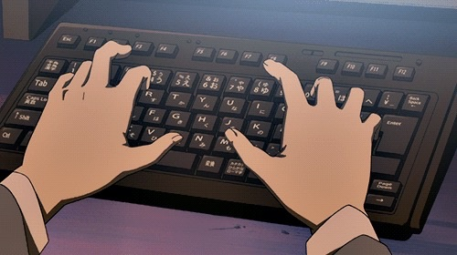
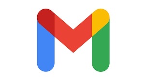

    

   

<h3 align="center">A Little About Me 💖</h3>

   ✨ I’m passionate about blending technology and creativity!  
   💻 Cybersecurity, AI, and Software Engineering are my areas of focus. 
   🎨 When I’m not coding, I love reading, watching kdramas, and going on nature walks!

<h3 align="center">Currently Learning 📚</h3>

   I'm diving into AI-driven anomaly detection in cybersecurity. 

  

<h3 align="center">Let’s Connect! 📬</h3>

  
  &nbsp;&nbsp;&nbsp;
  

